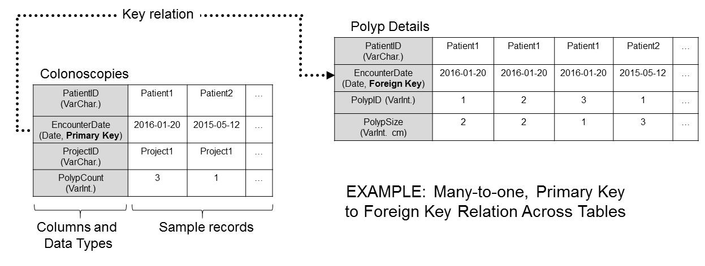
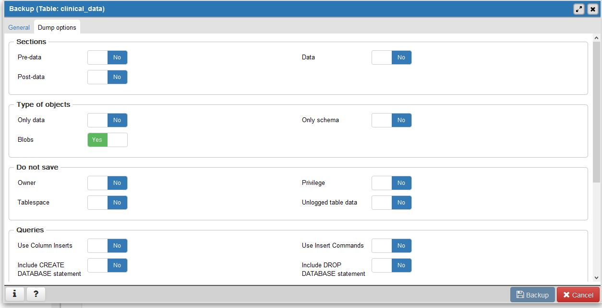

# Purpose

This document details the basics and essentials of managing, adding, and extracting data in the Grady Lab postgreSQL server.

The server contains data bases for management of records, documents, and data concerning patients and samples from various consortia.

Two key aspects to the database are: 
1. Static storage (inc. its formatting, relations, and layout); 
2. Dynamic data access (inc. Views and associated SQL scripts, functions, indecies, and other ephemera that are generated secondarily to static data)

The two aspects are clearly distinct but also closely related. 
Concerns with 1. include maximizing efficiency and ease of data access, management, and additions. 
Concerns with 2 are related to the data structures and relations from 1. 
Hence, the goal is to optimize static storage while also ensuring dynamic access needs are met.

# Document Layout:
## I. Introduction
A brief introduction to postgreSQL and essential database concepts and terminology.

## II. Practical Information
Practical information that most users will need for accessing and managing data, with minimal recourse to SQL coding. Includes directions for user access and setup, data import/export, schema objects overview, and basic use of tables, Views, and predefined scripts and objects in general. 

## III. Technical Information 
Detailed information for database maintainers and developers, including proposals for and examples of View design and other non-table schema objects that make up the pre-defined dynamic data access framework.

## Appendices
Additional information, mainly SQL commands and example scripts for Views.

## TODO
Plans and proposals for document updates. 

# I. Introduction

PostgreSQL (or PGSQL, pgsql, etc.) is an extension of the traditional Relational Database Management System (RDBMS). It introduces additional functionality such as support for additional schema objects, data types, and dynamics, including arrays, inheritence, and functions. These extensions make it a powerful Object-Relational Database Management System (ORDBMS).

PGSQL databases consist of schemas, which organize data into varying types. The most important is, of course the table, which is the object where data entries are stored. Additional objects include Views, which generate so-called pseudo-tables based on query and script definitions. Importantly, SQL language queries are central to managing and querying data in pgsql. 

## Database Objects
### Table Basics
Tables are schema objects set up as a matrix grid with rows and columns. They contain data entries in rows (aka. records, etc.), while columns in a table have designated data types, eg. integer, character (single), character (varying length), text (varying length character string), date, etc. Of note, there is no constraint on the number of rows (namely, the constraint is the storage hardware), while up to ~1600 columns are allowable.

In addition to these designations, which constrain the type of data that can be entered under a given column, there are more abstract and dynamic constraints that can be applied. They are called "Primary Key", "Foreign Key", "Check", "Unique", and "Exclude" constraints, respectively. These are convenient for ensuring the database is orderly and adding implicit functionality or automation to static tables, all while providing insight into the intent of table design to database users. 

#### Key Relations
Key relations are an example of additional constraints that inform table design. In a table with a column designated as a Primary Key, the column is constrained to have unique and non-null entries. That is, records in that table cannot be repeated and cannot have a null primary key value. This is convenient for several reasons - first, it adds a constraint that keeps entries tidy and logical, and second, it allows for a many-to-one relation with other tables via a Foreign Key designation, which is convenient for structuring data queries. 

To demonstrate, the Grady Lab database includes two patient records tables: a patients table that indexes patients and their date of birth; and a colonoscopies table that tracks available data from patient colonoscopies. The following figure depicts the schema design of these two tables with the fields, data types, constraints, and example records. For the patients table, the patientid column is not null, unique, and a primary key. For the colonoscopies table, the patientid column is also not null, but it is also a foreign key to the corresponding patientid column in the patients table. This adds an additional constraint to the colonoscopies patientid field, where no patientid can be included in that table if it does not also occur in the patients table. This means we can have records of patients in the patients table without corresponding colonoscopies (so long as there are no preexisting records with the same patientid in the patients table), but we cannot have colonoscopies recorded in the colonoscopies table without a patientid corresponding to a record in the patients table. 



#### Database Schema
The schema refers to the design of tables and other schema objects, including their relations to one another. This is the fundamental structure and relations of the static data and database tables. The generation of database schema is called normalization.

 

The schema for the grady lab database will be backed up on the grady lab [github page](https://github.com/GradyLab/GradyLab_PostgreSQL). 

Database schema can be viewed as a series of table creation scripts written in SQL. To automatically get table creation scripts from pgAdmin, right click the table in the left-hand menu and select: "Scripts" > "CREATE Script" then save, or instead select "Backup" and choose from the dump options tab whether to export the schema, the data, or both.



# II. Practical Information
## Setting Up The Connection (For Hutch databases)
The Hutch now hosts lab servers (or "database containers") on the local gizmo clusters. These are then backed up periodically.  

### PostgreSQL Clients
#### Database Creation and Superuser Access

The following describes initial setup, with implicit superuser access for the database creator. Skip further down for details on setting up users with restricted access and logging in as such a user.

To connect to a database, first make sure a database container has been created through Hutch [MyDB](https://mydb.fredhutch.org/login). Store the user identification and password for later use, as you will later connect to the server/container as a client with superuser access.

Next, install [postgreSQL](https://www.postgresql.org/download/) and [pgAdmin](https://www.pgadmin.org/) to your local harddrive. The former is the main system with certain essential modules and scripts that extend functionality. The latter is a widely-used GUI for managing postgreSQL databases, and includes highly useful options for data viewing, import/export, management, etc. while conveniently displaying underlying SQL code for user GUI interactions.   

Set up a connection as a pgSQL client in pgAdmin by:  
1. Right click 'servers' in lefthand menu, then Create>Servers  
2. In popup window, select Connection tab  
3. In connection tab, populate the entries with:  
A. Host name (eg. "mydb")  
B. Port (eg. 12345)  
C. Maintenance Database (eg. "name-of-database")  
D. Username   
E. Password  
4. Save.  
  
You should have a connection to the database server hosted on the Hutch gizmo clusters.   

To start accessing databases, schemas, tables, etc. select the server name then go to:
Databases > select desired database > Schemas > select desired schema or default 'public' schema > select/right-click Tables  

 

#### User Creation and Restricted Access

(TBD)
  
## Using pgAdmin to Manage Data
The following describes how to approach data management in the pgAdmin GUI. 

### Setting up the Binary Path
Many essential features in pgAdmin require access to modules initially installed with postgreSQL. To ensure pgAdmin can access these, Click File>Preferences>Paths>Binary Paths
Enter the local path to the directory with the modules, eg. by default: " C:>Program Files>PostgreSQL>9.6>bin" Where '>' is replaced by forward or backward slashes.

### Importing and Exporting Excel .csv Files

Via pgAdmin, postgreSQL handles Excel quite well by default. Certain variables are reformatted automatically, such as dates, when they are imported. However, it should be possible to import a table with minimal modification to the cell attributes in Excel. 
That is, on import the Excel csv columns will be made to conform to the pre-specified column attributes in the destination postgreSQL table.  

That said, here are the general steps to take to import a csv from Excel:  
1. Either verify a postgreSQL table exists or make a new postgreSQL table that will be the destination table for the Excel data. This will involve specification of the column classes or data types, as well as a specific name for each column and an explicit column order.    

 

2. Make sure the Excel file to import matches the format of the destination postgreSQL table.
Namely, make sure:   
A. The excel file only contains columns corresponding to those in the destination table, 
B. All columns are in the same order as the destination table  
C. Data formatting doesn't violate any of the column class restraints in the destination table (eg. if a column is "integer" then no entries like "123a")  

3. Once the csv is properly formatted, navigate to the table in pgAdmin, right click and select "Import/Export". On the window, select the parameters to match the Figure (Fig#).
Next, select the  Columns tab and deselect all the columns except the ones in your excel file and destination table. The only columns left should correspond to your data columns, and these should be listed in the same order as in the csv and table. 

4. Click 'Ok.'

 

### Views
Views are one primary way that such queries are possible in the postgreSQL system. They are objects in the schema assembled by "definitions", which is essentially a SQL query or script. The advantage of Views is they are dynamic. That is, when their referent data is updated, they too can be rerun and updated to reflect those changes. It is extremely convenient that the defining script is stored with the pseudo-table, and therefore can be rerun as desired, even by a user not versed in SQL. 

The above leads to a need for iterative use and reuse of View definition scripts. That is, to ensure efficient data storage and maximize utility, scripts should be frames as generally as possible, such that the filtering criteria can be modified without changing the underlying code for the query.

For instace, one script might address the following query: 

__"List all patients with at least two recorded colonoscopies, where polyps were found on only the index, and whose age is at least 70 years old."__

This should be translated to a View that filters on:   
1. number of patient colonoscopies >=2;   
2. number of polyps at index >0;   
3. number of polyps at second (later) colonoscopy = 0;   
and 4. age >= 70.  

The specific qualifiers ">=2", ">0", "0", and ">=70" should thus be treated as variables when writing the view definition, such that subsequent queries for 80 year old or 60 year olds with at least 3 colonoscopies or at least 1 polyp on followup could make use of the same or similar View definition, with minimal alterations.  

At a later date, these qualifiers could be treated as variables in a wrapper function for a user interface (eg. a shiny application).

# III. Technical Information for Dynamic Data Access Framework
## Intro. to SQL

(TBD)

Note: there are no inherent order to rows (aka. 'tuples' or 'records') for data storage, and thus one needs to specify in SQL search if order is important for query. 

## Non-table Schema Objects
In addition to tables, there are several ephemera not related to static stored data which are unique to object-relational management systems. These include column indecies, views, and functions.

When dealing with rich datasets encompassing medical records, cohort clinical data, lab sample records, and downstream analytical platform records, framing a simple question can become complicated when translated into a scripted query.
This necessitates a well designed static data storage layout that is conducive to these kinds of queries. 

## View Design
Once a view has been effectively designed and saved, its definition can then be copied and used iteratively with differing variable values. 

When designing a view, it is helpful to break down the intended query into subunits that can be tackled with their own code chunks. For instance, to design a filter on age at colonoscopy, it is vital to first derive the ages by taking the interval between the 'dob' date of birth provided in the patients table and the 'encounter_date' encounter date provided in the colonoscopies table.

A second design strategy builds complex temporary tables through nesting. While not necessarily aesthetically appealing, it ensures a modular build where nested sub tables can be extracted, placed into a view, and be used to successfully build a pseudo table with more limited filtering criteria. An example is provided with 3b1 and 2b2 in the appendix. 3b1 is a table showing encounters for patients whose index encounters have a minimum number of total polyps reported by the attending physician. 3b2 builds on this extensively by adding the additional filtering criteria of minimum patient age at encounter, minimum polyps reported at encounter, and minimum total encounters available after filtering, while also adopting the index encounter polyp count filter from 3b1. 

# Appendix

## 1. Common PGSQL/SQL Commands

1. CREATE DATABASE - creates new database
2. CREATE INDEX - creates new index on a table column
3. CREATE SEQUENCE - creates new sequenc in existing database
4. CREATE TRIGGER - creates new trigger in existing database
5. CREATE VIEW - create new view in existing table
6. SELECT - retrieve records from a table
7. INSERT - adds one or more new records into table
8. UPDATE - modifies the data in existing table records
9. DELETE - removes existing records from a table
10. DROP DATABASE - destroys existing database
11. DROP INDEX - removes column index from an existing table
12. DROP SEQUENCE - destroys existing sequence generator
13. DROP TABLE - destroys existing table
14. DROP TRIGGER - destroys existing trigger
15. DROP VIEW - destroys an existing table view
16. CREATE USER - adds new postgreSQL account to the system
17. ALTER USER - modifies existing pgSQL user account
18. DROP USER - removes existing pgSQL user account
19. GRANT - grant rights on a database object to a user
20. REVOKE - deny rights on a database object from a user
21. CREATE FUNCTION - creats new SQL function within a database
22. CREATE LANGUAGE - creates new language definition within a database
23. CREATE OPERATOR - creates new SQL operator within a database
24. CREATE TYPE - creates new SQL data type within a database

## 3. Example View Definitions
### 3a. QUERY: On a by-encounter,by-patient basis, how many polyps have details recorded in the polyps table? 

Definition:
```{r eval=FALSE}
SELECT polyps1.encounter_date,
    count(polyps1.encounter_date) AS count,
    polyps.patient_id
   FROM gldata.polyps
GROUP BY polyps.encounter_date, polyps.patient_id;
```

### 3b1. What endoscopies are from patients whose index endoscopy had a minimum number of polyps? This query is nested in 3b2

Definition:
```{r eval=FALSE}
SELECT *
FROM gldata.colonoscopies AS coln
WHERE coln.patient_id 
IN (	SELECT colonoscopies.patient_id 		
			FROM gldata.colonoscopies 
			WHERE index='T'
    		AND colonoscopies.total_polyps_reported >= 1) /* FILTER ON TOTAL POLYPS AT INDEX */
ORDER BY coln.patient_id,coln.encounter_date;
```

### 3b. QUERY: What patients have encounters with a minimum age, recorded polyp count, total polyp count, and minimum index encounter polyp count? Show results as array aggregations by patient (every row is a patient, entries can contain info from multiple encounters). 

Definition:
```{r eval=FALSE}
SELECT pat.patient_id,
t.ne AS num_encounters,
t.ed AS encounter_dates,
t.ea AS encounter_ages,
t.pr AS polyps_recorded_by_encounter,
t.tp AS total_polyps_reported,
t.i index_id
FROM gldata.patients pat,
( SELECT ct.patient_id,
  array_agg(ct.age_yrs) AS ea,
  array_agg(ct.encounter_date) AS ed,
  array_agg(ct.npolyps) AS pr,
  count(ct.encounter_date) AS ne,
  array_agg(ct.total_polyps_reported) AS tp,
  array_agg(ct.index) AS i
  FROM ( SELECT gc.patient_id,
         date_part('year', age(gc.encounter_date, p.dob)) AS age_yrs,
         gc.encounter_date,
         gc.total_polyps_reported,
         gc.index,
         p.dob,
         npolt.n_polyps AS npolyps
         FROM gldata.patients AS p,
         gldata.colonoscopies AS gc,
         ( SELECT glc.patient_id,
           glc.encounter_date,
           count((polyps.encounter_date || '-') || polyps.patient_id) AS n_polyps
           FROM gldata.colonoscopies glc
           LEFT JOIN gldata.polyps ON glc.patient_id = polyps.patient_id AND glc.encounter_date = polyps.encounter_date
           GROUP BY glc.patient_id, glc.encounter_date
           ORDER BY glc.patient_id, glc.encounter_date) npolt
         WHERE p.patient_id = gc.patient_id
         AND p.patient_id = npolt.patient_id 
         AND gc.encounter_date = npolt.encounter_date 
         AND (gc.patient_id IN ( SELECT glc.patient_id
                                       FROM gldata.colonoscopies glc
                                       WHERE glc.index = true AND glc.total_polyps_reported >= 0))) ct
  WHERE ct.age_yrs >= 0 AND ct.npolyps >= 0
  GROUP BY ct.patient_id, ct.dob) t
WHERE pat.patient_id = t.patient_id
AND t.ne >= 1;
```

# TODO
1. Add connections to pgsql example db and show results of View queries. 
2. Add table export (to Excel .csv format) directions.
3. Flesh out the static repository structure plan, frame so updates are possible.
4. Flesh out Views script/query Appendix examples with known queries.
