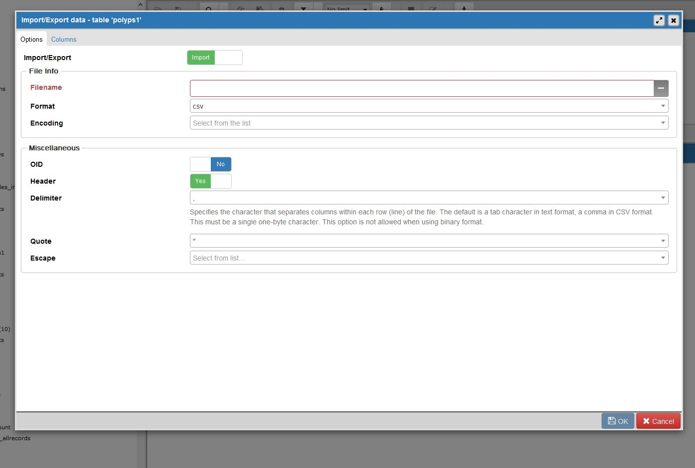

# Purpose

This document details the basics and essentials of managing, adding, and extracting data in the Grady Lab postgreSQL server.

The server contains data bases for management of records, documents, and data concerning patients and samples from various consortia.

Two key aspects to the database are: 
1. Static storage (inc. its formatting, relations, and layout); 
2. Dynamic data access (inc. Views and associated SQL scripts, functions, indecies, and other ephemera that are generated secondarily to static data)

The two aspects are clearly distinct but also closely related. 
Concerns with 1. include maximizing efficiency and ease of data access, management, and additions. 
Concerns with 2 are related to the data structures and relations from 1. 
Hence, the goal is to optimize static storage while also ensuring dynamic access needs are met.

# Document Layout:
## I. Introduction
There is a brief introduction to the database, the postgreSQL object-relational database management system, and the SQL syntax. 

## II. Practical Information
Practical information that most users will need for accessing and managing data, with minimal recourse to SQL coding

## III. Technical Information 
Information for database developers, maintainers and extenders. Explanations of Views and other non-table schema objects that make up the pre-defined dynamic data access framework, including ideas for expanding or iterating on aspects of the existing framework.

## Appendices
Additional information, mainly SQL commands and example scripts for Views.

# I. Introduction

# II. Practical Information  
### PostgreSQL CLIENTS

To connect to a database, first make sure a database container has been created through Hutch MyDB (https://mydb.fredhutch.org/login)

Next, install postgreSQL and pgAdmin to your local harddrive. 

Set up a connection as a pgSQL client in pgAdmin by:  
1. Right click 'servers' in lefthand menu, then Create>Servers  
2. In popup window, select Connection tab  
3. In connection tab, populate the entries with:  
A. Host name (eg. "mydb")  
B. Port (eg. 12345)  
C. Maintenance Database (eg. "name-of-database")  
D. Username   
E. Password  
4. Save.  
  
You should have a connection to the database server hosted on the Hutch gizmo clusters.   

To start accessing databases, schemas, tables, etc. select the server name then go to:
Databases > select desired database > Schemas > select desired schema or default 'public' schema > select/right-click Tables
 
  

# SETTING UP THE BINARY PATH
Many essential features in pgAdmin require access to modules initially installed with postgreSQL. To ensure pgAdmin can access these, Click File>Preferences>Paths>Binary Paths
Enter the local path to the directory with the modules, eg. by default: `r paste0("C:\\\\Program Files\\\\PostgreSQL\\\\9.6\\\\bin")`

# IMPORTING AND EXPORTING EXCEL .csv FILES

Via pgAdmin, postgreSQL handles Excel quite well by default. Certain variables are reformatted automatically, such as dates, when they are imported. However, it should be possible to import a table with minimal modification to the cell attributes in Excel. 
That is, on import the Excel csv columns will be made to conform to the pre-specified column attributes in the destination postgreSQL table.  

That said, here are the general steps to take to import a csv from Excel:  
1. Either verify a postgreSQL table exists or make a new postgreSQL table that will be the destination table for the Excel data. This will involve specification of the column classes or data types, as well as a specific name for each column and an explicit column order. 

 

2. Make sure the Excel file to import matches the format of the destination postgreSQL table.
Namely, make sure:   
A. The excel file only contains columns corresponding to those in the destination table, 
B. All columns are in the same order as the destination table  
C. Data formatting doesn't violate any of the column class restraints in the destination table (eg. if a column is "integer" then no entries like "123a")  

3. Once the csv is properly formatted, navigate to the table in pgAdmin, right click and select "Import/Export". On the window, select the parameters to match the Figure (Fig#).
Next, select the  Columns tab and deselect all the columns except the ones in your excel file and destination table. The only columns left should correspond to your data columns, and these should be listed in the same order as in the csv and table. 

4. Click 'Ok.'

 

# III. Technical Information for Dynamic Data Access Framework
### INTRO TO SQL SYNTAX

There are no inherent order to rows (aka. 'tuples' or 'records') for data storage, and thus one needs to specify in SQL search if order is important for query. 

### VIEWS
In addition to tables, there are several ephemera not related to static stored data which are unique to object-relational management systems. 
These include column indecies, views, and functions.

When dealing with rich datasets encompassing medical records, cohort clinical data, lab sample records, and downstream analytical platform records, framing a simple question can become complicated when translated into a scripted query.
This necessitates a well designed static data storage layout that is conducive to these kinds of queries. 

Views are one primary way that such queries are possible in the postgreSQL system. They are objects in the schema assembled by "definitions", which is essentially a SQL query or script.
The advantage of Views is they are dynamic. That is, when their referent data is updated, they too can be rerun and updated to reflect those changes. 
It is extremely convenient that the defining script is stored with the pseudo-table, and therefore can be rerun as desired, even by a user not versed in SQL. 

The above leads to a need for iterative use and reuse of View definition scripts. 
That is, to ensure efficient data storage and maximize utility, scripts should be frames as generally as possible, such that the filtering criteria can be modified without changing the underlying code for the query.
For instace, one script might address the following query: 

"List all patients with at least two recorded colonoscopies, where polyps were found on only the index, and whose age is at least 70 years old."

This should be translated to a View that filters on: 
1. number of patient colonoscopies >=2;   
2. number of polyps at index >0;   
3. number of polyps at second (later) colonoscopy = 0;   
and 4. age = 70.  

The specific qualifiers ">=2", ">0", "0", and "70" should thus be treated as variables when writing the view definition, such that subsequent queries for 80 year old or 60 year olds with at least 3 colonoscopies or at least 1 polyp on followup could make use of the same View definition with minimal alterations.  

At a later date, these qualifiers could be treated as variables in a wrapper function for a user interface (eg. a shiny application).

# Appendix

### COMMON PostgreSQL COMMANDS

1. CREATE DATABASE - creates new database
2. CREATE INDEX - creates new index on a table column
3. CREATE SEQUENCE - creates new sequenc in existing database
4. CREATE TRIGGER - creates new trigger in existing database
5. CREATE VIEW - create new view in existing table
6. SELECT - retrieve records from a table
7. INSERT - adds one or more new records into table
8. UPDATE - modifies the data in existing table records
9. DELETE - removes existing records from a table
10. DROP DATABASE - destroys existing database
11. DROP INDEX - removes column index from an existing table
12. DROP SEQUENCE - destroys existing sequence generator
13. DROP TABLE - destroys existing table
14. DROP TRIGGER - destroys existing trigger
15. DROP VIEW - destroys an existing table view
16. CREATE USER - adds new postgreSQL account to the system
17. ALTER USER - modifies existing pgSQL user account
18. DROP USER - removes existing pgSQL user account
19. GRANT - grant rights on a database object to a user
20. REVOKE - deny rights on a database object from a user
21. CREATE FUNCTION - creats new SQL function within a database
22. CREATE LANGUAGE - creates new language definition within a database
23. CREATE OPERATOR - creates new SQL operator within a database
24. CREATE TYPE - creates new SQL data type within a database

### Example View Definitions
1. QUERY: On a by-encounter,by-patient basis, how many polyps have details recorded in the polyps table? 

DEFINITION:
```{r}
# SELECT polyps1.record_date,
#    count(polyps1.record_date) AS count,
#    polyps1.patientid
#   FROM clinical_data.polyps1
# GROUP BY polyps1.record_date, polyps1.patientid;
```

# TODO
1. Add connections to pgsql example db and show results of View queries. 
2. Add table export (to Excel .csv format) directions.
3. Flesh out the static repository structure plan, frame so updates are possible.
4. Flesh out Views script/query Appendix examples with known queries.

